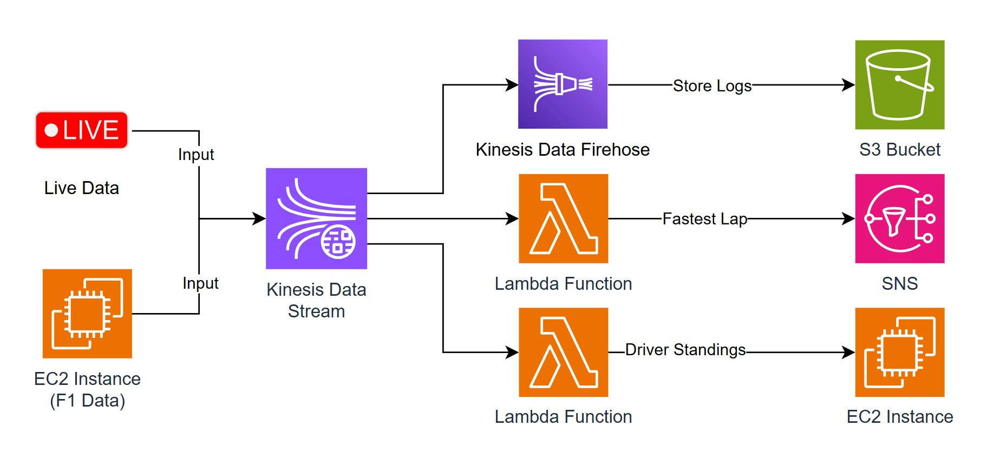

# F1 Telemetry Analysis using AWS

## Project Description

The **F1 Race Data Streaming and Visualization System** is a real-time application designed to simulate, process, and visualize Formula 1 race data. It leverages AWS services such as **Kinesis**, **Lambda**, **SNS**, and **S3**, along with web technologies like **Flask**, to provide a dynamic, interactive dashboard for tracking driver positions, lap times, tyre details, and other race statistics.

The system uses **FastF1** to simulate a race session and streams real-time race data into an AWS Kinesis Data Stream. The data is processed through multiple Lambda functions and sent to a Flask web server, which updates a live dashboard showing drivers' positions, lap numbers, tyre compounds, tyre ages, and more.

## Architecture Diagram

## Key Components

### **Race Simulation and Data Streaming `simulate-race.py`**

- This script uses the `FastF1` library to simulate the race session.
- Data points such as driver name, lap number, position, tyre compound, tyre age, and sector times are extracted and sent to an **AWS Kinesis Data Stream** in near real-time.
- The simulation runs at 10x speed for faster updates.
- Data is continuously sent to **Kinesis** for further processing by AWS Lambda.

### **Data Processing with AWS Lambda**

There are two Lambda functions:

1. **Driver Position Update Lambda**:
    
    This Lambda function listens to the Kinesis Data Stream, decodes the race data, and forwards the driver position details to a Flask web server via an HTTP POST request.
    
2. **Fastest Lap Detection Lambda**:
    
    This Lambda function processes race data to detect the fastest lap. When a new fastest lap is detected, an **SNS** (Simple Notification Service) alert is triggered, sending the details of the fastest lap.
    

### **Web Server with Flask**

- A Flask-based web server hosts a live dashboard that visualizes driver positions and race updates.
- It receives data from the Lambda function via HTTP POST requests and updates the current standings.
- A HTML table displays race data (driver, team, position, lap number, tyre compound, and tyre age), refreshing every 5 seconds to show real-time updates.
- The Flask web server uses the `/positions` endpoint to fetch sorted driver positions.
- A simple HTML page is used for the front-end, which continuously fetches updated driver positions every 5 seconds using JavaScript.
- Data is displayed in a tabular format, with real-time updates on driver positions, tyre compounds, and tyre ages.